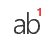
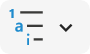
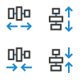
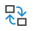
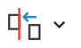
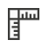

# ProDeck PowerPoint Toolbar Addin

ProDeck is a PowerPoint add-in designed to help those who work extensively with PowerPoint, such as consultants. It provides a suite of tools to quickly assemble, format, and clean slide decks. While many paid products offer similar or more advanced functionalities, ProDeck was created to democratize access to these tools for individuals and small companies that may not have the budget for expensive software. ProDeck offers several features to help users edit slides more efficiently, saving valuable time.

To install on Windows or Mac:
- Download the `.ppam` in the [releases page](https://github.com/rodrigolourencofarinha/ProDeck/releases)
- **Important!** Read [installation instructions](https://github.com/rodrigolourencofarinha/ProDeck/releases) 

## Why I Created This

As a project manager at a strategy consulting firm, I quickly learned that a well-designed toolbar can save hours of work. I tested several commercial options like [Power-User](https://www.powerusersoftwares.com/) and [BrightSlide](https://www.brightcarbon.com/brightslide/), but found they either didn’t offer the exact features I needed or were overloaded with unnecessary tools. I also tried other free and open-source alternatives, but they were often too rough and riddled with bugs.

With that in mind, I developed ProDeck based on three core principles:
1. **Simplicity**: Include only the essential functions most users need, avoiding unnecessary complexity.
2. **Seamless Integration**: Avoid intrusive branding by using icons already available in Microsoft PowerPoint. If a required icon isn’t available, I hand-draw it to match the Office design language.
3. **Polished and Intuitive**: Ensure the add-in is bug-free, easy to use, and intuitive. For example, buttons in ProDeck are grayed out when a function cannot be applied, mimicking the official Office behavior. The goal is for users to feel as though this add-in was developed by Microsoft itself.

## Requirements

- **Microsoft Office**: ProDeck was developed for the latest version of Office, but it may work on older versions with potential bugs.
- **Windows or Mac**: While ProDeck works on both Windows and Mac, it performs better on Windows. In the future, I plan to release a Mac-specific version to address certain features and characteristics.

## Features 

Below are some key features, though not all are listed.

| Icon                                                                                                           | Feature                                                   | Description                                                                                |
|----------------------------------------------------------------------------------------------------------------|-----------------------------------------------------------|--------------------------------------------------------------------------------------------|
|                                                      | Batch Add or Delete                                       | Add/Delete objects from all slides.                                                        |
|                                                   | Insert Sticky Note                                        | Insert a sticky note on the slide                                                          |
|                                                                | Insert Headings                                           | Insert multiple headings                                                                   |
|                                                 | Insert or Reposition Footnote                             | Insert or reposition footnote                                                              |
|                                          | Multilevel Bullet Points                                  | Set multilevel bullet points, ticks or crosses                                             |
|                                                    | Text Box Margins On/Off                                   | Toggle text box margins on/off                                                             |
|                                                       | Fill Color                                                | Select all objects with the same color                                                     |
|                                                             | All Colors                                                | Replace colors in selected slides                                                          |
|                                                            | Connect Shapes                                            | Connect side of shape 1 to the side of shape 2                                             |
|                                    | Increase or Decrease Spacing                              | Increase or decrease spacing between objects                                               |
|                                                              | Swap Positions                                            | Swap positions of selected objects                                                         |
|                                                              | Stack Objects                                             | Stack objects based on the first selected object                                           |
|                                                                | Match Size                                                | Resize selected objects to match size (height and/or width)                                |
|                                                              | Rectify Lines                                             | Rectify lines to default horizontal or vertical positions                                  |
|                                                          | Merge or Split Text                                       | Merge or split text within selected objects into one object                                |
|                                                       | Hide or Unhide Objects                                    | Hide or unhide objects in the slide                                                        |
|                                                          | Change Language                                           | Change proofing language in the entire deck                                                |
|  | Clean Deck | Offers various functionalities, including the ability to remove all line breaks from a selected shape and eliminate double spaces from selected slides. It allows exporting notes and comments from all slides to a text file, fixing slide footers and numbers, and deleting unwanted properties such as animations, comments, and transitions. Additionally, it provides confidentiality settings to anonymize and erase metadata. |
|                                                                | Label Slides                                              | Label slides and contents                                                                  |
|                                                      | Classify Document                                         | Put mark on all slides regarding the document classification                               |

## Installing & Uninstalling

### Installation Instructions

A step-by-step guide to installing **ProDeck** in PowerPoint:

#### For Windows

1. **Prerequisite**: Ensure any previous versions of ProDeck are uninstalled to avoid conflicts.
2. **Download ProDeck**: Download the latest [release of ProDeck](https://github.com/rodrigolourencofarinha/ProDeck/releases) (i.e., `.ppam` file).
3. **Move the File**: Place the `.ppam` file in the correct add-ins folder: `C:\Users\[Your Username]\AppData\Roaming\Microsoft\AddIns`
4. **Configure PowerPoint**:
   - Open PowerPoint and go to **File** > **Options**.
   - Select **Add-ins**.
   - Under the **Manage** section, select **PowerPoint Add-ins** and click **Go**.
5. **Add ProDeck**:
   - Click **Add New** in the add-ins window.
   - Navigate to the folder where you saved the ProDeck `.ppam` file, select it, and click **OK**.
6. **Complete Installation**:
   - The ProDeck tab should now appear in the PowerPoint ribbon, confirming successful installation.

#### For Mac

1. **Download ProDeck**: Download the `.ppam` file to a preferred folder (e.g., Downloads).
2. **Open PowerPoint**: Launch PowerPoint on your Mac.
3. **Add the Add-In**:
   - Click on **Tools** from the top menu, then select **Add-ins**.
   - In the Add-ins window, click the **+** button at the bottom left and browse to the location where you saved ProDeck.
   - Select the file and click **Open**.
4. **Enable Macros**: Ensure macros are enabled for full functionality of ProDeck.

### Uninstallation Instructions

A step-by-step guide to uninstalling **ProDeck**:

1. **Open PowerPoint**: Ensure PowerPoint is open and that the ProDeck tab is visible in the ribbon.
2. **Access Add-Ins**: 
   - Go to **File** > **Options**, then select **Add-ins**.
3. **Manage Add-Ins**: 
   - Under the **Manage** section, select **PowerPoint Add-ins** and click **Go**.
4. **Remove ProDeck**:
   - In the add-ins window, select **ProDeck** from the list and click **Remove**.
5. **Complete Uninstallation**:
   - Close the add-ins window. The ProDeck tab should disappear from PowerPoint, confirming that the add-in has been successfully uninstalled.

For both **Windows** and **Mac**, these steps will ensure a smooth installation and uninstallation process.

## How You Can Contribute

You are welcome to submit issues and bug reports via this GitHub repository. I will review them whenever I can.

## How to Develop Your Own

You have three alternatives based on your skill level:

### For Beginners
   1. **Build from the `.pptm` file**: 
     - I suggest this approach if you are just starting out and want to use or customize the existing code without diving too deeply into VBA or advanced development.

### For Advanced Users
   2.  **Fork this repo**: If you are familiar with Git and want to customize the project, you can fork this repository.
   3. **Build your own `.pptm` file**:You can start from scratch or use this repo as a base and develop your own `.pptm` (PowerPoint Macro-Enabled Presentation) file, adding or modifying the macros to suit your needs.

## How to Edit the Code
To edit the macros and custom functionality within the `.pptm` file, follow these steps:

1. **Enable the Developer Tab in the Ribbon**: If you don't already have the Developer tab visible, activate it by following [this guide](https://support.microsoft.com/en-us/office/show-the-developer-tab-in-word-e356706f-1891-4bb8-8d72-f57a51146792).

2. **Access the VBA Editor**: Click on the `Developer` tab, then click on `Visual Basic` to open the VBA editor.

3. **Navigating the VBA Editor**:
   - **Modules Folder**: 
     - This is where you should place your macros. Macros are scripts written in VBA that automate tasks in PowerPoint.
   - **Class Modules**:
     - These are used to create objects with their own properties and methods. You can customize behaviors or extend functionality by adding new class modules.
   - **Forms**:
     - You can create custom forms (dialog boxes) that interact with the user. Forms contain controls like buttons, text fields, and checkboxes to gather user input or perform specific tasks.
    
4. **Edit the Ribbon:** Download the [Office RibbonX Editor](https://github.com/fernandreu/office-ribbonx-editor) to edit the ribbon

### Additional Resources
- [VBA Documentation](https://docs.microsoft.com/en-us/office/vba/api/overview/powerpoint) – Microsoft's official documentation for PowerPoint VBA.
- [StackOverflow PowerPoint VBA](https://stackoverflow.com/questions/tagged/powerpoint-vba) – For questions and community support related to PowerPoint VBA.

## Other Amazing Open Source Tools
- [Instrumenta](https://github.com/iappyx/Instrumenta): A couple of functions in ProDeck were ported from Instrumenta
- [ColorPicker](https://github.com/ericaddison/VBA-PPT-ColorPicker): A highly useful tool that allows for changing all colors in the deck efficiently, implemented in ProDeck to streamline color customization.
- [Office Fluent UI Identifiers](https://github.com/OfficeDev/office-fluent-ui-command-identifiers): A great resource for finding identifiers to make the add-in look seamless.
